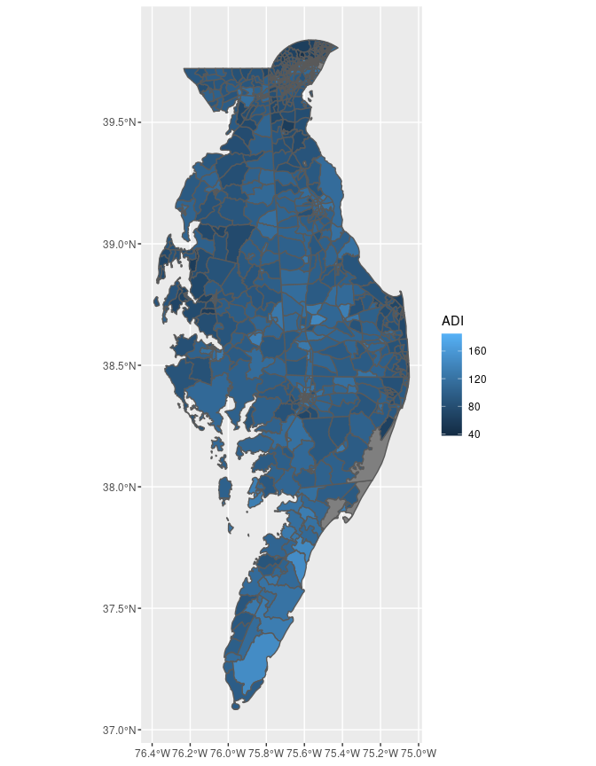
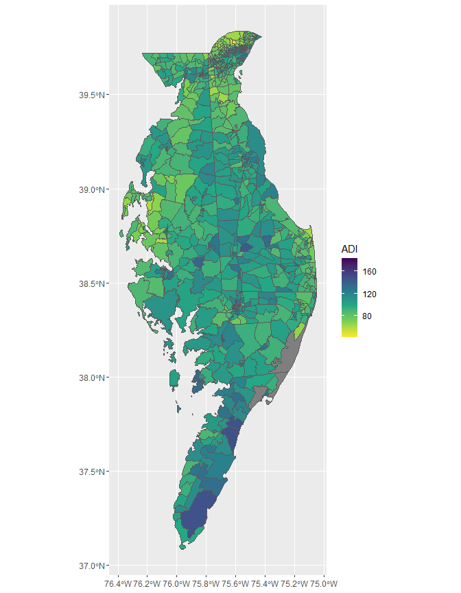
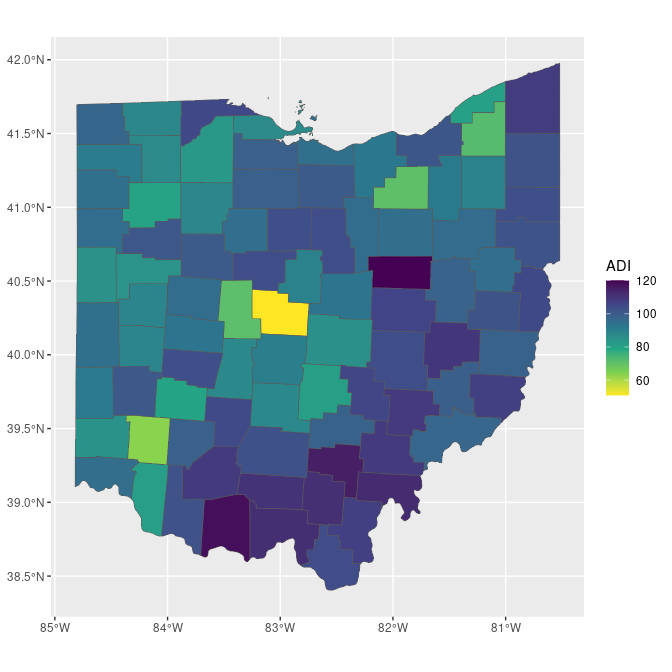
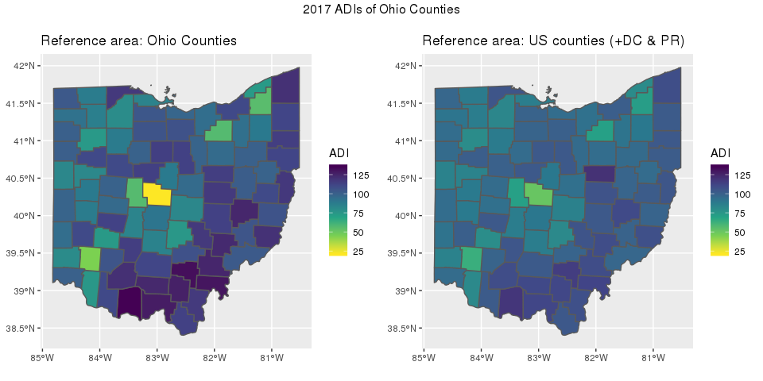

<!-- README.md is generated from README.Rmd. Please edit that file -->
sociome
=======

> The dimensions of existence that are social.

The goal of the `sociome` package is to help the user to operationalize social determinants of health data in their research.

The current functionality is limited to measures of area deprivation in the United States, but we intend to expand into other elements of the "sociome."

We have implemented a variation of Singh's area deprivation index (ADI), which allows for estimation at the state, county, census tract, or census block group level and which allows for using different iterations of data from the American Community Survey (ACS).

The result is a more flexible framework for representing neighborhood deprivation. The `get_adi()` function is the primary tool for generating these indices. It allows the user to customize the desired **reference population** down to the block group level when calculating ADI. This enables the user to compare only the specific locations of interest without having to include other areas in the calculation of ADI. See the section called "Choosing a **reference population**" below for more detail.

The output of `get_adi()` can be piped directly into `ggplot2::geom_sf()` for mapping.

Installation
------------

You can install sociome from github with:

``` r
# install.packages("devtools")
devtools::install_github("NikKrieger/sociome")
```

Background on ADI
-----------------

In short,

> "The Area Deprivation Index (ADI) is based on a measure created by the Health Resources & Services Administration (HRSA) over two decades ago for primarily county-level use, but refined, adapted, and validated to the Census block group/neighborhood level by Amy Kind, MD, PhD and her research team at the University of Wisconsin-Madison. It allows for rankings of neighborhoods by socioeconomic status disadvantage in a region of interest (e.g. at the state or national level)."
> <https://www.neighborhoodatlas.medicine.wisc.edu>

The *original* ADIs are static measures that G. K. Singh formulated in 2003 (Singh GK. Area deprivation and widening inequalities in US mortality, 1969-1998. Am J Public Health 2003;93(7):1137-43). Kind et al. utilized the 2013 edition of the ACS five-year estimates in order to formulate an updated ADI, which was announced in 2018. Rankings based on this ADIs are available via downloadable datasets at <https://www.neighborhoodatlas.medicine.wisc.edu/download>.

The ADI that Kind et al. formulated is a national measure on each census block group in the US; the specific ADI value associated with each block group in the US is calculated in reference to all other block groups in the US. In other words, Kind et al. used the entire US as the **reference population** in their formulation. Concordantly, a given area might be assigned a different ADI value depending on the reference population utilized in its formulation; for example, the ADI of the wealthiest census block group in Milwaukee might be lower if it is computed using only the Milwaukee area as the reference population as opposed to using the entire US as the reference population. The `get_adi()` function flexibly allows for specifying the **reference population** for ADI estimation. See examples below.

Customizing the **reference population**
----------------------------------------

The algorithm that produced the ADIs of Singh and Kind et al. employs factor analysis. As a result, the ADI is a relative measure; the ADI of a particular location is dynamic, varying depending on which other locations were supplied to the algorithm. In other words, ADI will vary depending on the **reference population**.

For example, the ADI of Orange County, California is *x* when calculated alongside all other counties in California, but it is *y* when calculated alongside all counties in the US.

The `get_adi()` function enables the user to define a reference population by feeding a vector of GEOIDs to its `geoid` parameter (or alternatively for convenience, a vector of state abbreviations to its `state` parameter). The function then gathers data from those specified locations and performs calculations using their data alone.

*Localized* ADIs via `get_adi()`
--------------------------------

The `get_adi()` function returns a table (viz., a `tibble` or `sf tibble`) of *localized* Singh's area deprivation indices (ADIs). The user chooses:

-   the level of geography whose ADIs are desired (viz., state, county, census tract, or census block group)
-   the year
-   the ACS estimates (viz. the one-, three-, or five-year estimates)
-   the **reference population** (see above).

The function then calls the specified ACS data sets and employs the same algorithms that were used to calculate the *original* ADIs, resulting in *localized* ADIs. It stands on the shoulders of the `get_acs()` function in Kyle Walker's `tidycensus` package (see <https://walkerke.github.io/tidycensus>), which is what enables the user to so easily select specific years and specific ACS estimates. `get_adi()` also benefits from the shapefile-gathering capabilities of `get_acs()`, which enables the user to create maps depicting ADI values with relative ease, thanks to `geom_sf()` in `ggplot2`.

Examples
--------

The following code returns the ADIs of all counties in New Mexico, using the 2016 edition of the 5-year ACS estimates (the defaults):

``` r
library(sociome)
get_adi(geography = "county", state = "NM", geometry = FALSE)
#> # A tibble: 33 x 3
#>    GEOID NAME                            ADI
#>    <chr> <chr>                         <dbl>
#>  1 35001 Bernalillo County, New Mexico  85.9
#>  2 35003 Catron County, New Mexico      79.4
#>  3 35005 Chaves County, New Mexico     107. 
#>  4 35006 Cibola County, New Mexico     120. 
#>  5 35007 Colfax County, New Mexico     107. 
#>  6 35009 Curry County, New Mexico      102. 
#>  7 35011 De Baca County, New Mexico     98.0
#>  8 35013 Do?a Ana County, New Mexico   109. 
#>  9 35015 Eddy County, New Mexico        85.6
#> 10 35017 Grant County, New Mexico       97.9
#> # ... with 23 more rows
```

Setting `geometry = FALSE` as performed above is useful when only a `tibble` of ADI values is needed (i.e., maps need not be drawn) because the default output of `sf tibbles` is verbose. The following is an `sf tibble` of the ADIs of the fifty US states plus the District of Columbia and Puerto Rico, using the 2012 edition of the 1-year ACS estimates:

``` r
get_adi(geography = "state", year = 2012, dataset = "acs1")
#> Simple feature collection with 52 features and 3 fields
#> geometry type:  MULTIPOLYGON
#> dimension:      XY
#> bbox:           xmin: -179.2311 ymin: 17.83151 xmax: 179.8597 ymax: 71.44106
#> epsg (SRID):    4269
#> proj4string:    +proj=longlat +ellps=GRS80 +towgs84=0,0,0,0,0,0,0 +no_defs
#> First 10 features:
#>    GEOID                 NAME       ADI                       geometry
#> 1     06           California  92.63861 MULTIPOLYGON (((-117.3209 3...
#> 2     08             Colorado  86.21834 MULTIPOLYGON (((-109.0501 4...
#> 3     09          Connecticut  77.18939 MULTIPOLYGON (((-73.50793 4...
#> 4     10             Delaware  90.02628 MULTIPOLYGON (((-75.76007 3...
#> 5     11 District of Columbia  75.43209 MULTIPOLYGON (((-77.11975 3...
#> 6     12              Florida 108.15988 MULTIPOLYGON (((-87.45002 3...
#> 7     13              Georgia 111.95943 MULTIPOLYGON (((-84.12944 3...
#> 8     15               Hawaii  66.41013 MULTIPOLYGON (((-155.9633 1...
#> 9     16                Idaho 103.48496 MULTIPOLYGON (((-116.8978 4...
#> 10    17             Illinois  97.36981 MULTIPOLYGON (((-90.71598 3...
```

The user can mix different levels of geography in the `geoid` parameter. The code below stores the ADIs of the census block groups in every county entirely or partially on the Delmarva peninsula:

``` r
delmarva_geoids <- c("10", "51001", "51131", "24015", "24029", "24035", "24011",
                     "24041", "24019", "24045", "24039", "24047")
# The two-digit GEOID stands for the state of Delaware.
# The five-digit GEOIDs stand for specific counties in Virginia and Maryland

delmarva <- get_adi(geography = "block group", geoid = delmarva_geoids)
# The Delmarva peninsula lies on the east coast of the US
# and is split between DELaware, MARyland, and VirginiA.
```

The unique advantage of `sociome`'s `get_adi()` function is that it removes the need for researchers to separately download, merge, and filter different data files for each state or county. A single call to `get_adi()` automatically downloads, filters, and merges each necessary data set.

When setting `geometry = TRUE`, `sf` data is gathered from the US census API. This allows `get_adi()` output to be piped directly into `geom_sf()` from the `ggplot2` package. Below is a demonstration of this capability, using the Delmarva peninsula county ADIs created above:

``` r
library(ggplot2)

delmarva %>% ggplot() + geom_sf(aes(fill = ADI))
```



Notice that the default behavior of `geom_sf()` is to make high-ADI areas lighter in color than low-ADI areas, which is counterintuitive. While not necessarily *incorrect*, this can be "fixed" using other `ggplot` features, such as `scale_fill_viridis_c(direction = -1)`.

Furthermore, the gray borders between census block groups are a bit thick and in many cases totally obscure some of the smaller block groups. Borders can be removed by setting `lwd = 0` within the `geom_sf()` function.

``` r
delmarva %>%
  ggplot() +
  geom_sf(aes(fill = ADI), lwd = 0) +
  scale_fill_viridis_c(direction = -1)
```



### Demonstration of the relative nature of ADIs, using custom reference populations

The code below calculates and maps ADIs for Ohio counties.

``` r
ohio <- get_adi(geography = "county", state = "OH")

ohio %>%
  ggplot() +
  geom_sf(aes(fill = ADI)) +
  scale_fill_viridis_c(direction = -1)
```


The code below also calculates and maps ADIs for Ohio counties, but it uses a reference population of all counties in the fifty states plus DC and Puerto Rico:

``` r
ohio_ref_US <- 
  get_adi(geography = "county") %>%
  dplyr::filter(substr(GEOID, 1, 2) == "39")
  # Ohio's GEOID is 39, so the GEOIDs of all Ohio counties begin with 39.

ohio_ref_US %>%
  ggplot() +
  geom_sf(aes(fill = ADI)) +
  scale_fill_viridis_c(direction = -1)
```



Notice how the ADI of each county varies depending on the reference population provided. This map allows the viewer to visually compare and contrast Ohio counties based on an ADI calculated with all US counties as the reference population.

**However, also notice that the above two maps are not completely comparable** because their color scales are different. Each time `ggplot` draws one of these maps, it sets the color scale by setting the lightest color to the lowest ADI in the data set and the darkest color to the highest ADI in the data set. The data sets that were used to create the two maps above have different minimum and maximum ADIs, so between the two maps, identical colors do not stand for identical ADI values.

In order to remedy this, we need `ggplot` to set its lightest and darkest color to the same ADI value for each map. **This can be accomplished by adding the `limits` argument to `scale_fill_viridis_c()`.** The `limits` argument is a numeric vector of length two; `ggplot` associates its lightest color with the first number and its darkest color with the second number.

The following code reproduces the two maps above with the same color scale, making them comparable:

``` r
library(gridExtra)
# Contains grid.arrange(), which allows for side-by-side plotting of figures

color_range <- range(c(ohio$ADI, ohio_ref_US$ADI))
# This produces a numeric vector of length two, containing the lowest and
#   highest ADI value among the two data sets. This ensures that the full color
#   range will be used while keeping the scales the same.

ohio_plot <-
  ohio %>%
  ggplot() +
  geom_sf(aes(fill = ADI)) +
  scale_fill_viridis_c(direction = -1, limits = color_range) +
  labs(title = "Reference area: Ohio Counties")

ohio_ref_us_plot <-
  ohio_ref_US %>%
  ggplot() +
  geom_sf(aes(fill = ADI)) +
  scale_fill_viridis_c(direction = -1, limits = color_range) +
  labs(title = "Reference area: US counties (+DC & PR)")

grid.arrange(ohio_plot, ohio_ref_us_plot,
             nrow = 1, top = "2016 ADIs of Ohio Counties")
```



Notice that there is a middling effect on Ohio ADIs when all US counties are used as the reference population; this implies that Ohio counties are neither among the most deprived nor the least deprived in the US.

Advanced users: extracting the factor loadings
----------------------------------------------

Advanced users interested in the details of the principal components analysis used to obtain the ADI values can obtain the factor loadings of the measures involved. `get_adi()` utilizes `psych::principal()`, which provides factor loadings that are then stored as an `attribute` of the `tibble` or `sf tibble` that `get_adi()` returns. This `attribute` is a named numeric vector called `loadings`.

The following code would access and store the factor loadings of the `ohio` ADI table created above:

``` r
ohio_loadings <- attr(ohio, "loadings")
ohio_loadings
#>                         medianHouseholdIncome 
#>                                     0.9670304 
#>                                medianMortgage 
#>                                     0.8225148 
#>                                    medianRent 
#>                                     0.7762467 
#>                              medianHouseValue 
#>                                     0.8761827 
#>                          pctFamiliesInPoverty 
#>                                    -0.8875432 
#>                       pctOwnerOccupiedHousing 
#>                                     0.3703107 
#>  ratioThoseMakingUnder10kToThoseMakingOver50k 
#>                                    -0.9125100 
#> pctPeopleLivingBelow150PctFederalPovertyLevel 
#>                                    -0.9312437 
#>           pctChildrenInSingleParentHouseholds 
#>                                    -0.6257419 
#>                    pctHouseholdsWithNoVehicle 
#>                                    -0.4569110 
#>                  pctPeopleWithWhiteCollarJobs 
#>                                     0.6197517 
#>                           pctPeopleUnemployed 
#>                                    -0.6265516 
#>               pctPeopleWithAtLeastHSEducation 
#>                                     0.5945981 
#>        pctPeopleWithLessThan9thGradeEducation 
#>                                    -0.2666329 
#>         pctHouseholdsWithOverOnePersonPerRoom 
#>                                    -0.3085936
```

These loadings code can then be converted into a readable `tibble`:

``` r
tibble::tibble(factor = names(ohio_loadings), loadings = ohio_loadings)
#> # A tibble: 15 x 2
#>    factor                                        loadings
#>    <chr>                                            <dbl>
#>  1 medianHouseholdIncome                            0.967
#>  2 medianMortgage                                   0.823
#>  3 medianRent                                       0.776
#>  4 medianHouseValue                                 0.876
#>  5 pctFamiliesInPoverty                            -0.888
#>  6 pctOwnerOccupiedHousing                          0.370
#>  7 ratioThoseMakingUnder10kToThoseMakingOver50k    -0.913
#>  8 pctPeopleLivingBelow150PctFederalPovertyLevel   -0.931
#>  9 pctChildrenInSingleParentHouseholds             -0.626
#> 10 pctHouseholdsWithNoVehicle                      -0.457
#> 11 pctPeopleWithWhiteCollarJobs                     0.620
#> 12 pctPeopleUnemployed                             -0.627
#> 13 pctPeopleWithAtLeastHSEducation                  0.595
#> 14 pctPeopleWithLessThan9thGradeEducation          -0.267
#> 15 pctHouseholdsWithOverOnePersonPerRoom           -0.309
```

Warning about missing data and sample size
------------------------------------------

Calculating ADI values with a reference area containing under thirty locations is not recommended. The user will receive a warning when attempting to do so, but ADI values will be returned nonetheless.

While allowing flexibility in specifying reference populations, data from the ACS are masked for sparsely populated places and may have too many missing values to return ADIs in some cases (i.e., too much missingness for imputation). When this happens, `get_adi()` will return a `tibble` of the factors that could not undergo imputation, followed by the raw census data.

Here is a demonstration of both of the above:

``` r
get_adi("block group", state = "hi", county = "kalawao", year = 2015)
#> Getting data from the 2011-2015 5-year ACS
#> Warning in calculate_adi(data = ref_area_data, type = dataset, keep_indicators = keep_indicators): 
#> Calculating ADI values from fewer than 30 locations.
#> It is recommended to add more in order to obtain trustworthy results.
#> 
#> Imputation unsuccessful.
#> Returning factors that could not be imputed followed by raw census data.
#> # A tibble: 2 x 140
#>   GEOID  NAME  medianHousehold… medianMortgage medianRent medianHouseValue
#>   <chr>  <chr>            <dbl>          <dbl>      <dbl>            <dbl>
#> 1 15005… Bloc…            66250             NA        856               NA
#> 2 15005… Bloc…               NA             NA         NA               NA
#> # ... with 134 more variables: pctFamiliesInPoverty <dbl>,
#> #   pctOwnerOccupiedHousing <dbl>,
#> #   ratioThoseMakingUnder10kToThoseMakingOver50k <dbl>,
#> #   pctPeopleLivingBelow150PctFederalPovertyLevel <dbl>,
#> #   pctChildrenInSingleParentHouseholds <dbl>,
#> #   pctHouseholdsWithNoVehicle <dbl>, pctPeopleWithWhiteCollarJobs <dbl>,
#> #   pctPeopleUnemployed <dbl>, pctPeopleWithAtLeastHSEducation <dbl>,
#> #   pctPeopleWithLessThan9thGradeEducation <dbl>,
#> #   pctHouseholdsWithOverOnePersonPerRoom <dbl>, B01003_001E <dbl>,
#> #   B01003_001M <dbl>, B15003_001E <dbl>, B15003_001M <dbl>,
#> #   B15003_002E <dbl>, B15003_002M <dbl>, B15003_003E <dbl>,
#> #   B15003_003M <dbl>, B15003_004E <dbl>, B15003_004M <dbl>,
#> #   B15003_005E <dbl>, B15003_005M <dbl>, B15003_006E <dbl>,
#> #   B15003_006M <dbl>, B15003_007E <dbl>, B15003_007M <dbl>,
#> #   B15003_008E <dbl>, B15003_008M <dbl>, B15003_009E <dbl>,
#> #   B15003_009M <dbl>, B15003_010E <dbl>, B15003_010M <dbl>,
#> #   B15003_011E <dbl>, B15003_011M <dbl>, B15003_012E <dbl>,
#> #   B15003_012M <dbl>, B15003_017E <dbl>, B15003_017M <dbl>,
#> #   B15003_018E <dbl>, B15003_018M <dbl>, B15003_019E <dbl>,
#> #   B15003_019M <dbl>, B15003_020E <dbl>, B15003_020M <dbl>,
#> #   B15003_021E <dbl>, B15003_021M <dbl>, B15003_022E <dbl>,
#> #   B15003_022M <dbl>, B15003_023E <dbl>, B15003_023M <dbl>,
#> #   B15003_024E <dbl>, B15003_024M <dbl>, B15003_025E <dbl>,
#> #   B15003_025M <dbl>, B17010_001E <dbl>, B17010_001M <dbl>,
#> #   B17010_002E <dbl>, B17010_002M <dbl>, B19001_002E <dbl>,
#> #   B19001_002M <dbl>, B19001_011E <dbl>, B19001_011M <dbl>,
#> #   B19001_012E <dbl>, B19001_012M <dbl>, B19001_013E <dbl>,
#> #   B19001_013M <dbl>, B19001_014E <dbl>, B19001_014M <dbl>,
#> #   B19001_015E <dbl>, B19001_015M <dbl>, B19001_016E <dbl>,
#> #   B19001_016M <dbl>, B19001_017E <dbl>, B19001_017M <dbl>,
#> #   B19013_001E <dbl>, B19013_001M <dbl>, B23008_001E <dbl>,
#> #   B23008_001M <dbl>, B23008_008E <dbl>, B23008_008M <dbl>,
#> #   B23008_021E <dbl>, B23008_021M <dbl>, B23025_001E <dbl>,
#> #   B23025_001M <dbl>, B23025_005E <dbl>, B23025_005M <dbl>,
#> #   B25003_001E <dbl>, B25003_001M <dbl>, B25003_002E <dbl>,
#> #   B25003_002M <dbl>, B25014_001E <dbl>, B25014_001M <dbl>,
#> #   B25014_005E <dbl>, B25014_005M <dbl>, B25014_006E <dbl>,
#> #   B25014_006M <dbl>, B25014_007E <dbl>, B25014_007M <dbl>,
#> #   B25014_011E <dbl>, …
```

When working with ACS data, it is crucial to know when to use the ACS1, ACS3, or ACS5. See <https://www.census.gov/programs-surveys/acs/guidance/estimates.html>.

Lastly, the main dependencies of `sociome` (the `tidycensus` package and the Census API) are ongoing, evolving projects. Users may encounter errors having to do with the growing pains of the Census Bureau standardizing its syntax and `tidycensus` accommodating these breaking changes. Generally, until any significant changes to `tidycensus` occur that break backwards compatibility, any errors encountered when using `get_adi()` are a result of flaws in the Census API.

Grant information
-----------------

The development of this software package was supported by a research grant from the National Institutes of Health/National Institute on Aging, (Principal Investigators: Jarrod E. Dalton, PhD and Adam T. Perzynski, PhD; Grant Number: 5R01AG055480-02). All of its contents are solely the responsibility of the authors and do not necessarily represent the official views of the NIH.
