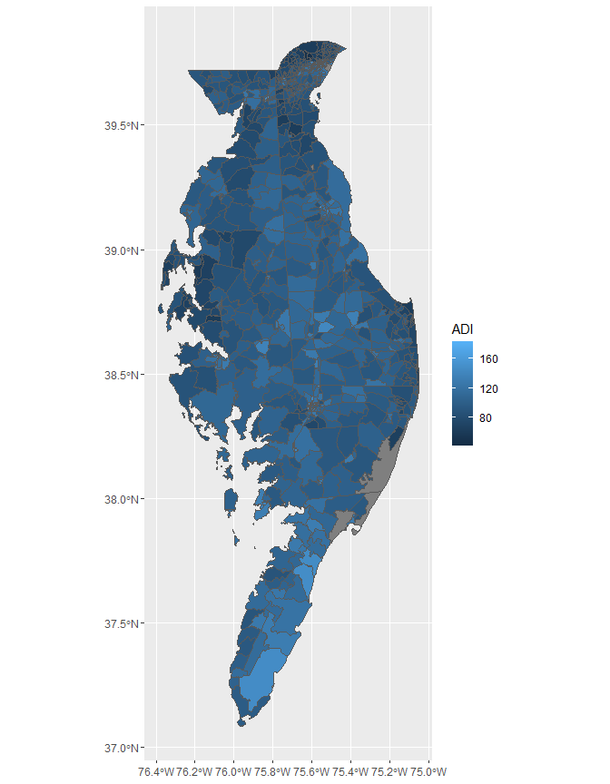
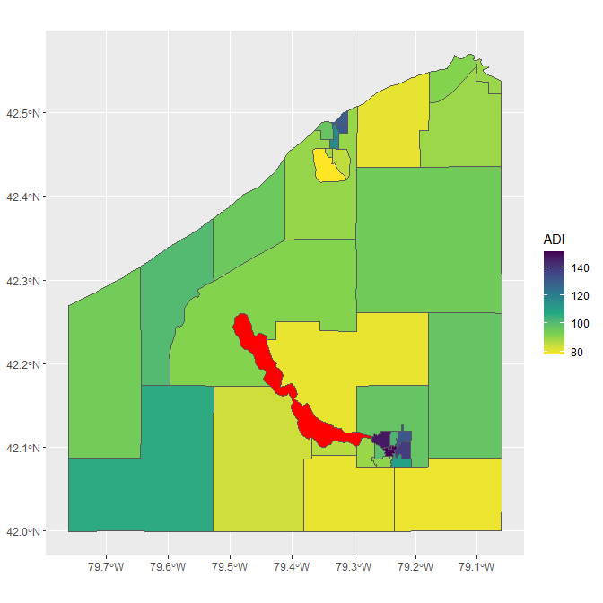
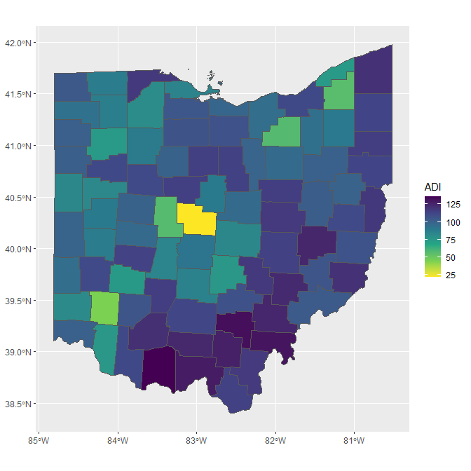
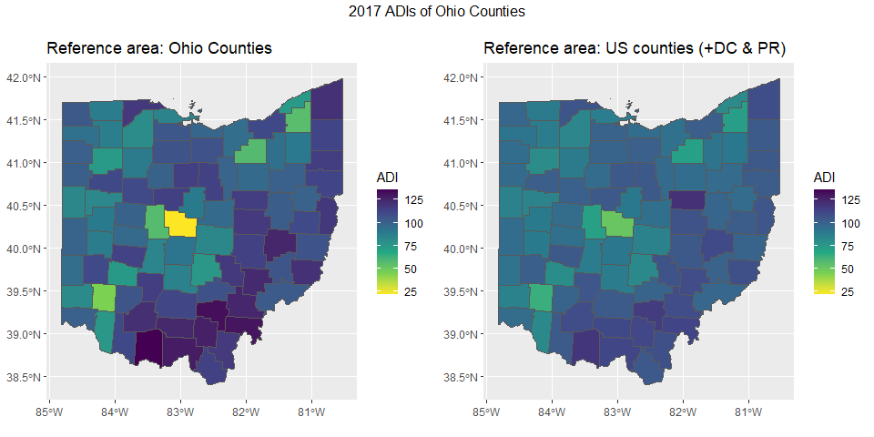

<!-- README.md is generated from README.Rmd. Please edit that file -->

# sociome

[](https://cran.r-project.org/package=sociome)


> The dimensions of existence that are social.

The goal of the `sociome` package is to help the user to operationalize
social determinants of health data in their research.

The current functionality is limited to measures of area deprivation in
the United States, but we intend to expand into other elements of the
“sociome.”

We have implemented a variation of Singh’s area deprivation index (ADI),
which allows for estimation at the state, county, census tract, or
census block group level and which allows for using different iterations
of data from the American Community Survey (ACS).

The result is a more flexible framework for representing neighborhood
deprivation. The `get_adi()` function is the primary tool for generating
these indices. It allows the user to customize the desired **reference
population** down to the block group level when calculating ADI. This
enables the user to compare only the specific locations of interest
without having to include other areas in the calculation of ADI. See the
section called “Choosing a **reference population**” below for more
detail.

The three comprising factors of the ADI, the ADI-3 ([Berg et al.,
2021](https://doi.org/10.1007/s10742-021-00248-6)), have been
incorporated and are now automatically included in the output of both
`get_adi()` and `calculate_adi()`, along with the ADI ([Singh,
2003](https://doi.org/10.2105/AJPH.93.7.1137)).

The output of `get_adi()` can be piped directly into
`ggplot2::geom_sf()` for mapping.

## Installation

You can install `sociome` from CRAN with:

``` r
install.packages("sociome")
```

You can install the development version of `sociome` from GitHub with:

``` r
remotes::install_github("ClevelandClinicQHS/sociome")
```

## Background on ADI

In short,

> “The Area Deprivation Index (ADI) is based on a measure created by the
> Health Resources & Services Administration (HRSA) over two decades ago
> for primarily county-level use, but refined, adapted, and validated to
> the Census block group/neighborhood level by Amy Kind, MD, PhD and her
> research team at the University of Wisconsin-Madison. It allows for
> rankings of neighborhoods by socioeconomic status disadvantage in a
> region of interest (e.g. at the state or national level).”
>
> <div style="text-align: right">
>
> <https://www.neighborhoodatlas.medicine.wisc.edu>
>
> </div>

The *original* ADIs are static measures that G. K. Singh formulated in
2003 (Singh GK. Area deprivation and widening inequalities in US
mortality, 1969-1998. Am J Public Health 2003;93(7):1137-43). Kind et
al. utilized the 2013 edition of the ACS five-year estimates in order to
formulate an updated ADI, which was announced in 2018. Rankings based on
this ADIs are available via downloadable datasets at
<https://www.neighborhoodatlas.medicine.wisc.edu/download>.

The ADI that Kind et al. formulated is a national measure on each census
block group in the US; the specific ADI value associated with each block
group in the US is calculated in reference to all other block groups in
the US. In other words, Kind et al. used the entire US as the
**reference population** in their formulation. Concordantly, a given
area might be assigned a different ADI value depending on the reference
population utilized in its formulation; for example, the ADI of the
wealthiest census block group in Milwaukee might be lower if it is
computed using only the Milwaukee area as the reference population as
opposed to using the entire US as the reference population. The
`get_adi()` function flexibly allows for specifying the **reference
population** for ADI estimation. See examples below.

## Customizing the **reference population**

The algorithm that produced the ADIs of Singh and Kind et al. employs
factor analysis. As a result, the ADI is a relative measure; the ADI of
a particular location is dynamic, varying depending on which other
locations were supplied to the algorithm. In other words, ADI will vary
depending on the **reference population**.

For example, the ADI of Orange County, California is *x* when calculated
alongside all other counties in California, but it is *y* when
calculated alongside all counties in the US.

The `get_adi()` function enables the user to define a reference
population by feeding a vector of GEOIDs to its `geoid` parameter (or
alternatively for convenience, a vector of state abbreviations to its
`state` parameter). The function then gathers data from those specified
locations and performs calculations using their data alone.

One important behavior of `get_adi()` is its excluding of areas that
have zero households from the reference population. Associating ADI
values with such areas is not meaningful and can skew the resulting ADIs
of the other areas within the reference population. Such areas are not
excluded from the tables that `get_adi()` returns, but their ADI values
are listed as `NA`.

## *Localized* ADIs via `get_adi()`

The `get_adi()` function returns a table (viz., a `tibble` or
`sf tibble`) of *localized* Singh’s area deprivation indices (ADIs). The
user chooses:

- the level of geography whose ADIs are desired (viz., state, county,
  census tract, or census block group)
- the year
- the ACS estimates (viz. the one-, three-, or five-year estimates)
- the **reference population** (see above).

The function then calls the specified ACS data sets and employs the same
algorithms that were used to calculate the *original* ADIs, resulting in
*localized* ADIs. It stands on the shoulders of the `get_acs()` and
`get_decennial()` functions in the `tidycensus` package (see
<https://CRAN.R-project.org/package=tidycensus>), which is what enables
the user to so easily select specific years and specific ACS estimates.
`get_adi()` also benefits from the `sf` (**s**hape**f**ile)-gathering
capabilities of `get_acs()` and `get_decennial()`, which enables the
user to create maps depicting ADI values with relative ease, thanks to
`geom_sf()` in `ggplot2`.

## Examples

The following code returns a `tibble` containing the ADIs and
corresponding ADI-3 values of the fifty US states plus the District of
Columbia and Puerto Rico, using the 2019 edition of the 1-year ACS
estimates:

``` r
library(sociome)
get_adi(geography = "state", year = 2019, dataset = "acs1")
#> # A tibble: 52 × 6
#>    GEOID NAME                   ADI Financial_Strength Economic_Hardship_and_I…¹
#>    <chr> <chr>                <dbl>              <dbl>                     <dbl>
#>  1 01    Alabama              118.                81.4                     111. 
#>  2 02    Alaska                84.8              110.                       92.9
#>  3 04    Arizona              105.                97.3                     103. 
#>  4 05    Arkansas             120.                76.2                     111. 
#>  5 06    California            85.4              135.                       95.0
#>  6 08    Colorado              79.2              122.                       83.1
#>  7 09    Connecticut           87.8              119.                       95.2
#>  8 10    Delaware              96.9              104.                       96.9
#>  9 11    District of Columbia  68.4              171.                      124. 
#> 10 12    Florida              104.                98.3                     103. 
#> # ℹ 42 more rows
#> # ℹ abbreviated name: ¹​Economic_Hardship_and_Inequality
#> # ℹ 1 more variable: Educational_Attainment <dbl>
```

The required argument `geography` designates the type of area for which
localized ADIs will be calculated: other options include `county`,
`tract`, `block group`, and `zcta`. The arguments `state`, `county`,
`geoid`, and `zcta` serve to narrow the reference population. The
arguments `dataset` and `year` select the type and year, respectively,
of the census data set used to calculate localized ADIs.

For example, the following is a `tibble` of the ADIs of the counties of
Connecticut, using 2010 decennial census data:

``` r
get_adi(geography = "county", state = "CT", year = 2010, dataset = "decennial")
#> Warning in calculate_adi(raw_data, keep_indicators = keep_indicators, seed = seed): 
#> Calculating ADI and ADI-3 values from fewer than 30 locations.
#> It is recommended to add more in order to obtain trustworthy results.
#> Warning in cor.smooth(r): Matrix was not positive definite, smoothing was done
#> Warning in psych::principal(indicators_hh_only[names(expected_signs)]): The
#> matrix is not positive semi-definite, scores found from Structure loadings
#> # A tibble: 8 × 6
#>   GEOID NAME                       ADI Financial_Strength Economic_Hardship_an…¹
#>   <chr> <chr>                    <dbl>              <dbl>                  <dbl>
#> 1 09001 Fairfield County, Conn…   78.2              142.                   100. 
#> 2 09003 Hartford County, Conne…  280.                91.3                  122. 
#> 3 09005 Litchfield County, Con…  -49.1               94.4                   81.2
#> 4 09007 Middlesex County, Conn…  -83.2              108.                    80.1
#> 5 09009 New Haven County, Conn…  289.                96.5                  125. 
#> 6 09011 New London County, Con…   77.3               93.9                   96.9
#> 7 09013 Tolland County, Connec… -120.               103.                    75.8
#> 8 09015 Windham County, Connec…  328.                71.2                  119. 
#> # ℹ abbreviated name: ¹​Economic_Hardship_and_Inequality
#> # ℹ 1 more variable: Educational_Attainment <dbl>
```

Notice the warning to the user that it is not recommended to calculate
ADIs for fewer than 30 locations. This warning occurred in this case
because Connecticut only has eight counties, and the ADI values of these
counties are erratic indeed.

The aforementioned `geoid` parameter allows the user to mix different
levels of geography when specifying a reference population. Employing
the 2019 version of the 5-year ACS estimates, the code below stores the
ADIs of the census block groups in every county entirely or partially on
the Delmarva peninsula. Note that `dataset = "acs5"` by default.

``` r
delmarva_geoids <-
  c("10",
    # The two-digit GEOID above stands for the state of Delaware.
    
    # The five-digit GEOIDs stand for specific counties in Virginia and Maryland
    "51001", "51131", "24015", "24029", "24035", "24011", "24041", "24019",
    "24045", "24039", "24047")

delmarva <-
  get_adi("block group", geoid = delmarva_geoids, year = 2019, geometry = TRUE)
# The Delmarva peninsula lies on the east coast of the US
# and is split between DELaware, MARyland, and VirginiA.
```

The unique advantage of `sociome::get_adi()` is that it removes the need
for researchers to separately download, merge, and filter different data
files for each state or county. A single call to `get_adi()`
automatically downloads, filters, and merges each necessary data set.

Notice that `geometry = TRUE` in the above code chunk, yielding an
`sf tibble`, wherein **s**hape**f**ile data for each area is included.
Printing `sf tibble`s is verbose, but they can be piped directly into
`geom_sf()` from the `ggplot2` package:

``` r
library(ggplot2)

delmarva %>% ggplot() + geom_sf(aes(fill = ADI))
```

<!-- -->

Notice that the default behavior of `geom_sf()` is to make high-ADI
areas lighter in color than low-ADI areas, which is counterintuitive.
While not necessarily *incorrect*, this can be “fixed” using other
`ggplot` features, such as `scale_fill_viridis_c(direction = -1)`.

Furthermore, the gray borders between census block groups are a bit
thick and in many cases totally obscure some of the smaller block
groups. Borders can be removed by setting `lwd = 0` within the
`geom_sf()` function.

``` r
delmarva %>%
  ggplot() +
  geom_sf(aes(fill = ADI), lwd = 0) +
  scale_fill_viridis_c(direction = -1)
```

<!-- -->

Careful scrutiny of this map reveals gray areas, such as the one near
the northern tip. These areas have no associated ADI because they were
excluded from ADI calculation due to having zero households. While these
areas are present in the ADI data set, their ADI values are `NA`. To
illustrate, below are the year-2009 ADI values for the then-35 census
tracts of Chautauqua County, New York, where Chautauqua Lake had its own
census tract (Census Tract 0 in the first row).

``` r
chautauqua <- 
  get_adi(
    "tract",
    state = "New York",
    county = "Chautauqua",
    year = 2009,
    dataset = "acs5",
    geometry = TRUE,
    keep_indicators = TRUE
  )
```

``` r
chautauqua %>%
  tibble::as_tibble() %>%
  dplyr::select(GEOID, NAME, ADI, B11005_001) %>% 
  print(n = Inf)
#> # A tibble: 35 × 4
#>    GEOID       NAME                                               ADI B11005_001
#>    <chr>       <chr>                                            <dbl>      <dbl>
#>  1 36013000000 Census Tract 0, Chautauqua County, New York       NA            0
#>  2 36013030100 Census Tract 301, Chautauqua County, New York    131.        1327
#>  3 36013030200 Census Tract 302, Chautauqua County, New York    102.        1600
#>  4 36013030300 Census Tract 303, Chautauqua County, New York    147.         844
#>  5 36013030400 Census Tract 304, Chautauqua County, New York     98.9       1900
#>  6 36013030500 Census Tract 305, Chautauqua County, New York    151.        1587
#>  7 36013030600 Census Tract 306, Chautauqua County, New York    138.        1572
#>  8 36013030700 Census Tract 307, Chautauqua County, New York    109.        1773
#>  9 36013030800 Census Tract 308, Chautauqua County, New York     90.1       1918
#> 10 36013035100 Census Tract 351, Chautauqua County, New York     91.2       1790
#> 11 36013035200 Census Tract 352, Chautauqua County, New York     88.7        873
#> 12 36013035300 Census Tract 353, Chautauqua County, New York     80.3        981
#> 13 36013035400 Census Tract 354, Chautauqua County, New York    131.        1258
#> 14 36013035500 Census Tract 355, Chautauqua County, New York    129.        1292
#> 15 36013035600 Census Tract 356, Chautauqua County, New York     96.5       1454
#> 16 36013035700 Census Tract 357, Chautauqua County, New York    116.        1337
#> 17 36013035800 Census Tract 358, Chautauqua County, New York     84.8       2004
#> 18 36013035901 Census Tract 359.01, Chautauqua County, New York  77.4       2392
#> 19 36013035902 Census Tract 359.02, Chautauqua County, New York  88.0        102
#> 20 36013036000 Census Tract 360, Chautauqua County, New York     89.3       1807
#> 21 36013036100 Census Tract 361, Chautauqua County, New York     94.4       2029
#> 22 36013036300 Census Tract 363, Chautauqua County, New York     95.2       2011
#> 23 36013036400 Census Tract 364, Chautauqua County, New York     91.2       2620
#> 24 36013036500 Census Tract 365, Chautauqua County, New York    101.        2250
#> 25 36013036600 Census Tract 366, Chautauqua County, New York     93.9       1496
#> 26 36013036700 Census Tract 367, Chautauqua County, New York    106.        1553
#> 27 36013036800 Census Tract 368, Chautauqua County, New York     83.2       1792
#> 28 36013036900 Census Tract 369, Chautauqua County, New York     80.0       2397
#> 29 36013037000 Census Tract 370, Chautauqua County, New York     80.0       1380
#> 30 36013037100 Census Tract 371, Chautauqua County, New York     85.7       1770
#> 31 36013037200 Census Tract 372, Chautauqua County, New York     88.9       1485
#> 32 36013037300 Census Tract 373, Chautauqua County, New York     96.8       2429
#> 33 36013037400 Census Tract 374, Chautauqua County, New York     96.8       1531
#> 34 36013037500 Census Tract 375, Chautauqua County, New York     79.5       1889
#> 35 36013940000 Census Tract 9400, Chautauqua County, New York    89.1         14
```

By having set `keep_indicators = TRUE`, the ADI factors as well as the
raw census data are retained in the `chautauqua` object. In output
above, these columns were filtered out except for `B11005_001`, which
denotes the number of households in each tract. Different census data
sets have different variable codes for the same type of data, and the
data sets `sociome::acs_vars` and `sociome::decennial_vars` serve as
keys to these variable codes.

Below is a map of the ADI data above. Note that the color of areas with
`NA` ADIs can be changed via the `na.value` argument in
`scale_fill_viridis_c()`.

``` r
chautauqua %>% 
  ggplot() +
  geom_sf(aes(fill = ADI)) + 
  scale_fill_viridis_c(direction = -1, na.value = "red")
```

<!-- -->

### Demonstration of the relative nature of ADIs, using custom reference populations

The code below calculates and maps ADIs for Ohio counties.

``` r
ohio <- get_adi("county", state = "OH", year = 2017, geometry = TRUE)

ohio %>%
  ggplot() +
  geom_sf(aes(fill = ADI)) +
  scale_fill_viridis_c(direction = -1)
```

<!-- -->

The code below also calculates and maps ADIs for Ohio counties, but it
uses a reference population of all counties in the fifty states plus DC
and Puerto Rico:

``` r
ohio_ref_US <- 
  get_adi("county", year = 2017, geometry = TRUE) %>%
  dplyr::filter(substr(GEOID, 1, 2) == "39")
  # Ohio's GEOID is 39, so the GEOIDs of all Ohio counties begin with 39.

ohio_ref_US %>%
  ggplot() +
  geom_sf(aes(fill = ADI)) +
  scale_fill_viridis_c(direction = -1)
```

<!-- -->

Notice how the ADI of each county varies depending on the reference
population provided. This map allows the viewer to visually compare and
contrast Ohio counties based on an ADI calculated with all US counties
as the reference population.

**However, also notice that the above two maps are not completely
comparable** because their color scales are different. Each time
`ggplot` draws one of these maps, it sets the color scale by setting the
lightest color to the lowest ADI in the data set and the darkest color
to the highest ADI in the data set. The data sets that were used to
create the two maps above have different minimum and maximum ADIs, so
between the two maps, identical colors do not stand for identical ADI
values.

In order to remedy this, we need `ggplot` to set its lightest and
darkest color to the same ADI value for each map. **This can be
accomplished by adding the `limits` argument to
`scale_fill_viridis_c()`.** The `limits` argument is a numeric vector of
length two; `ggplot` associates its lightest color with the first number
and its darkest color with the second number.

The following code reproduces the two maps above with the same color
scale, making them comparable:

``` r
library(gridExtra)
#> Warning: package 'gridExtra' was built under R version 4.3.2
# Contains grid.arrange(), which allows for side-by-side plotting of figures

color_range <- range(c(ohio$ADI, ohio_ref_US$ADI))
# This produces a numeric vector of length two, containing the lowest and
#   highest ADI value among the two data sets. This ensures that the full color
#   range will be used while keeping the scales the same.

ohio_plot <-
  ohio %>%
  ggplot() +
  geom_sf(aes(fill = ADI)) +
  scale_fill_viridis_c(direction = -1, limits = color_range) +
  labs(title = "Reference area: Ohio Counties")

ohio_ref_us_plot <-
  ohio_ref_US %>%
  ggplot() +
  geom_sf(aes(fill = ADI)) +
  scale_fill_viridis_c(direction = -1, limits = color_range) +
  labs(title = "Reference area: US counties (+DC & PR)")

grid.arrange(
  ohio_plot,
  ohio_ref_us_plot, 
  nrow = 1,
  top = "2017 ADIs of Ohio Counties"
)
```

<!-- -->

Notice that there is a middling effect on Ohio ADIs when all US counties
are used as the reference population; this implies that Ohio counties
are neither among the most deprived nor the least deprived in the US.

## Advanced users: extracting the factor loadings

Advanced users interested in the details of the principal components
analysis used to obtain the ADI values can obtain the factor loadings of
the measures involved. `get_adi()` utilizes `psych::principal()`, which
provides factor loadings that are then stored as an attribute of the
`tibble` or `sf tibble` that `get_adi()` returns. This attribute is a
`tibble` called `loadings`.

The following code accesses the factor loadings for the `ohio` ADI table
created above:

``` r
attr(ohio, "loadings")
#> # A tibble: 15 × 2
#>    factor                                        loading
#>    <chr>                                           <dbl>
#>  1 medianFamilyIncome                             -0.959
#>  2 medianMortgage                                 -0.831
#>  3 medianRent                                     -0.796
#>  4 medianHouseValue                               -0.876
#>  5 pctFamiliesInPoverty                            0.875
#>  6 pctOwnerOccupiedHousing                        -0.353
#>  7 ratioThoseMakingUnder10kToThoseMakingOver50k    0.900
#>  8 pctPeopleLivingBelow150PctFederalPovertyLevel   0.924
#>  9 pctHouseholdsWithChildrenThatAreSingleParent    0.644
#> 10 pctHouseholdsWithNoVehicle                      0.464
#> 11 pctPeopleWithWhiteCollarJobs                   -0.653
#> 12 pctPeopleUnemployed                             0.713
#> 13 pctPeopleWithAtLeastHSEducation                -0.584
#> 14 pctPeopleWithLessThan9thGradeEducation          0.252
#> 15 pctHouseholdsWithOverOnePersonPerRoom           0.298
```

## Warning about missing data and sample size

Calculating ADI values with a reference area containing under thirty
locations is not recommended. The user will receive a warning when
attempting to do so, but ADI values will be returned nonetheless.

While allowing flexibility in specifying reference populations, data
from the ACS are masked for sparsely populated places and may have too
many missing values to return ADIs in some cases (i.e., too much
missingness for imputation). When this happens, the data that could not
undergo imputation is accessible via
`rlang::last_error()$adi_indicators` and the tibble of raw census data
is accessible via `rlang::last_error()$adi_raw_data`. The former may
have fewer rows than the latter because areas with zero households are
excluded prior to calculation of the ADIs.

For example, ADIs cannot be obtained for the two block groups in Kalawao
County, Hawaii because there are only two of them, one of them having
zero households:

``` r
get_adi("block group", state = "hi", county = "kalawao", year = 2017)
#> Warning in calculate_adi(raw_data, keep_indicators = keep_indicators, seed = seed): 
#> Calculating ADI and ADI-3 values from fewer than 30 locations.
#> It is recommended to add more in order to obtain trustworthy results.
#> Error in `value[[3L]]()`:
#> ! Imputation unsuccessful. Neither ADIs nor ADI-3s were calculated.
#> 
#> Run rlang::last_error()$adi_indicators to access the indicator data
#> whose missingness could not be imputed. These data exclude areas with zero households.
#> 
#> Run rlang::last_error()$adi_raw_data to access the raw census data,
#> which includes areas with zero households (identified by the column named "B11005_001").
```

When working with ACS data, it is crucial to know when to use the ACS1,
ACS3, or ACS5. See
<https://www.census.gov/programs-surveys/acs/guidance/estimates.html>.

Lastly, the main dependencies of `sociome` (the `tidycensus` package and
the Census API) are ongoing, evolving projects. Users may encounter
errors having to do with the growing pains of the Census Bureau
standardizing its syntax and `tidycensus` accommodating these breaking
changes. Generally, until any significant changes to `tidycensus` occur
that break backwards compatibility, any errors encountered when using
`get_adi()` are a result of flaws in the Census API.

## Grant information

The development of this software package was supported by a research
grant from the National Institutes of Health/National Institute on
Aging, (Principal Investigators: Jarrod E. Dalton, PhD and Adam T.
Perzynski, PhD; Grant Number: 5R01AG055480-02). All of its contents are
solely the responsibility of the authors and do not necessarily
represent the official views of the NIH.
